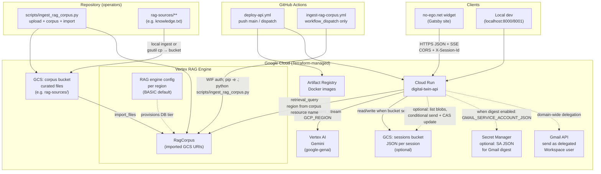
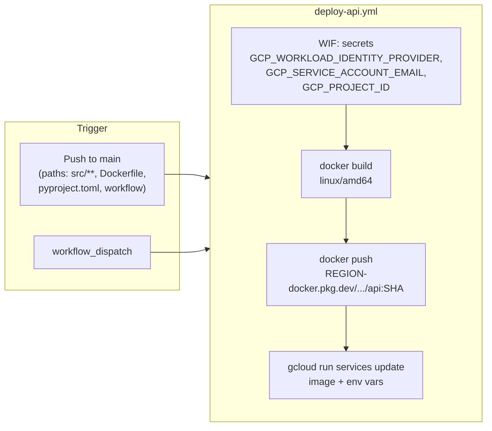
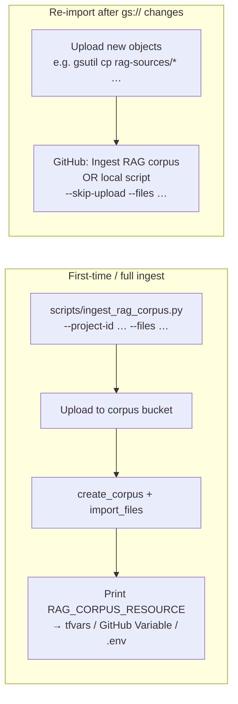
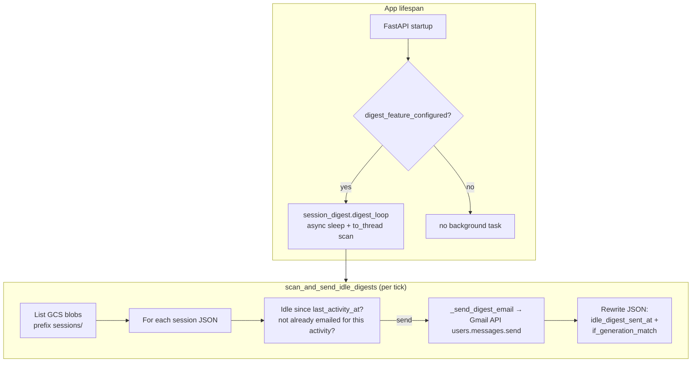
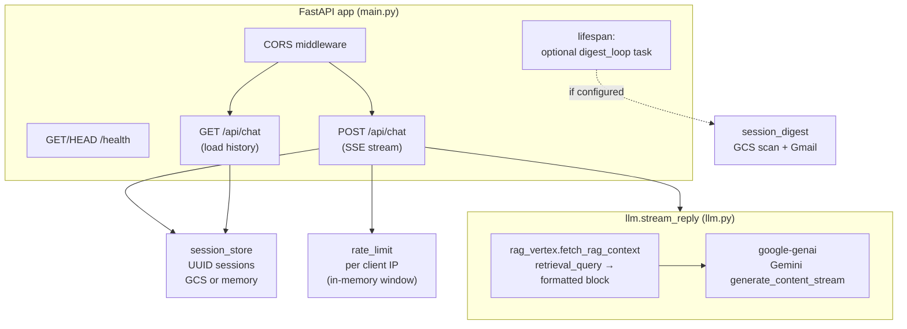
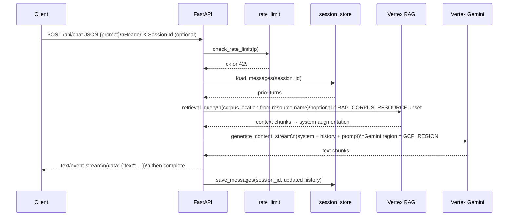

# Architecture

This document describes how the **digital-twin-api** service fits into the no-ego stack, what it depends on at runtime, and how changes reach production.

## System context

**Notes**

- **Sessions**: If `GCS_SESSIONS_BUCKET` is unset, history stays in **process memory** (lost on recycle/scale-out). Session JSON in GCS includes **`last_activity_at`** (set on each save) for digest eligibility.
- **Idle session digest (optional)**: When **`GCS_SESSIONS_BUCKET`**, **`RESUME_BOT_DIGEST_EMAIL_TO`**, and **Gmail** credentials are all configured, the app starts a **background loop** (`session_digest.digest_loop`) on startup. It periodically scans session blobs under the sessions prefix; after **`RESUME_BOT_DIGEST_IDLE_MINUTES`** (default 60) without activity, it emails a **plain-text transcript attachment** via **Gmail API** using a **service account** with **domain-wide delegation** as **`GMAIL_DELEGATED_USER`**. Successful sends set **`idle_digest_sent_at`** on the blob with **generation-match (CAS)** to reduce duplicate sends. **Requires GCS** (not in-memory sessions). With **multiple Cloud Run instances**, rare duplicate digests are possible unless you cap instances (see **`README.md`**).
- **RAG is optional**: If `RAG_CORPUS_RESOURCE` is unset, answers use **`system.md` only** (no retrieval). When set, `rag_vertex.fetch_rag_context` runs **`vertexai.rag.retrieval_query`**, formats chunks, and **`llm.stream_reply`** appends them to the system instruction before calling Gemini.
- **Two regions**: **Gemini** uses **`GCP_REGION`** (default `us-central1` on Cloud Run). **Retrieval** initializes Vertex in the **location embedded in `RAG_CORPUS_RESOURCE`** (e.g. `.../locations/europe-west4/ragCorpora/...` when using a backup ingest region). See `rag_vertex.py` and `terraform/README.md` (RAG backup region).
- **Tuning**: **`RAG_TOP_K`**, optional **`RAG_VECTOR_DISTANCE_THRESHOLD`** (see `main.py` / `.env.example`).
- **`RAG_CORPUS_RESOURCE` on Cloud Run**: Set via Terraform **`rag_corpus_resource_name`** → env on the service. **Deploy API** can also pass repository **Variable** `RAG_CORPUS_RESOURCE` on each deploy (`gcloud run services update` merges env vars); keep this aligned with the corpus you actually imported.
- **Terraform remote state**: Optional GCS backend — copy `terraform/backend.tf.example` to `backend.tf` after creating a state bucket (`terraform/versions.tf`).

## Deployment pipeline (API image)

On deploy, **environment variables** are applied with a **custom delimiter** (`^;^`) so **`CORS_ALLOWED_ORIGINS`** can contain commas. Optional repository **Variables** include **`RAG_CORPUS_RESOURCE`**, **`CORS_ALLOWED_ORIGINS`**, and for the digest feature **`RESUME_BOT_DIGEST_EMAIL_TO`**, **`GMAIL_DELEGATED_USER`**, **`GMAIL_SECRET_NAME`** (Secret Manager **secret id**). When Gmail variables are set alongside **`RESUME_BOT_DIGEST_EMAIL_TO`**, the workflow adds **`--set-secrets=GMAIL_SERVICE_ACCOUNT_JSON=GMAIL_SECRET_NAME:latest`** so the runtime receives the SA JSON without putting it in plain env (see `.github/workflows/deploy-api.yml`).

Secret names and copying Terraform outputs into GitHub are documented in **`terraform/README.md`** and helper **`scripts/print-github-actions-secrets.sh`**.

## RAG corpus lifecycle

Typical operator flow (details in **`terraform/README.md`** → RAG):

- **`.github/workflows/ingest-rag-corpus.yml`**: Manual dispatch only. Requires the same **secrets** as Deploy API plus repository **Variables** **`CORPUS_BUCKET_NAME`** and **`RAG_CORPUS_RESOURCE`**; optional **`RAG_INGEST_REGION`** (default **`europe-west4`** if not inferable). The checked-in step runs **`ingest_rag_corpus.py`** with **`--skip-upload`** (assumes objects already in the bucket); adjust **`--files`** in the workflow if you need different globs.
- **Local full ingest**: **`pip install -e .`**, ADC (`gcloud auth application-default login`), then **`scripts/ingest_rag_corpus.py`** (can create corpus, upload, import, and optionally ensure RAG engine tier — see script docstring).

## Idle session digest (email)

Background feature in **`session_digest.py`**, started from FastAPI **`lifespan`** in **`main.py`** when **`session_digest.digest_feature_configured()`** is true.

**Configuration (all required to enable)**

| Variable / secret | Role |
|-------------------|------|
| `GCS_SESSIONS_BUCKET` | Session persistence (digest does not run on in-memory-only mode). |
| `RESUME_BOT_DIGEST_EMAIL_TO` | Comma-separated recipient inbox(es). |
| `GMAIL_DELEGATED_USER` | Workspace user the SA impersonates (sender). |
| `GMAIL_SERVICE_ACCOUNT_JSON` | SA key JSON (production: from Secret Manager via deploy **`--set-secrets`**). |
| `GMAIL_SERVICE_ACCOUNT_KEY_FILE` | Local dev: path to SA JSON instead of inline env. |

One of **`GMAIL_SERVICE_ACCOUNT_JSON`** or **`GMAIL_SERVICE_ACCOUNT_KEY_FILE`** must be available at runtime (with **`GMAIL_DELEGATED_USER`**).

**Optional tuning**: `RESUME_BOT_DIGEST_IDLE_MINUTES` (default 60), `RESUME_BOT_DIGEST_SCAN_INTERVAL_SECONDS` (default 300), `RESUME_BOT_DIGEST_TIMEZONE` (subject/attachment display time, default `America/Los_Angeles`), `GCS_SESSIONS_PREFIX` (default `sessions`).

**Runbook**: Workspace admin setup, Gmail API enablement, Secret Manager, and GitHub Variables are in **`README.md`** → *Idle session digest*.

## In-process architecture (API service)

**`llm.stream_reply`** runs **`rag_vertex.fetch_rag_context`** first when **`RAG_CORPUS_RESOURCE`** is set (merges chunks into the system instruction), then calls **`google.genai`** with **`GCP_REGION`** for the model client. Session **save** after the stream is handled in **`main.py`**, not inside **`llm.py`**.

- **Rate limiting** is **per Cloud Run instance**; more replicas mean higher aggregate allowance unless you add shared state.
- **POST /api/chat** uses **`asyncio.to_thread`** for model work and session persistence so the event loop stays responsive.

## Chat request flow (POST)

## Repository layout (concise)

| Path | Role |
|------|------|
| `src/digital_twin/main.py` | HTTP API, SSE, env wiring |
| `src/digital_twin/llm.py` | System prompt; optional RAG block; Vertex Gemini streaming |
| `src/digital_twin/rag_vertex.py` | `vertexai.rag.retrieval_query` + chunk formatting |
| `src/digital_twin/session_store.py` | Session JSON in GCS or memory; **`last_activity_at`** on save |
| `src/digital_twin/session_digest.py` | Idle digest: GCS scan, Gmail send, **`idle_digest_sent_at`** + CAS |
| `src/digital_twin/rate_limit.py` | Per-IP RPM limit |
| `src/digital_twin/prompts/` | `system.md` (packaged in wheel) |
| `rag-sources/` | Curated corpus files for upload / ingest (e.g. `knowledge.txt`) |
| `scripts/ingest_rag_corpus.py` | Upload to corpus bucket, corpus create/import, CLI |
| `scripts/print-github-actions-secrets.sh` | Helper to print Terraform outputs for GitHub secrets |
| `terraform/` | Cloud Run, buckets, RAG engine, IAM, Artifact Registry, optional WIF |
| `terraform/backend.tf.example` | Template for GCS remote state |
| `.github/workflows/deploy-api.yml` | Build/push image, update Cloud Run |
| `.github/workflows/ingest-rag-corpus.yml` | Manual RAG re-import from bucket |

Runtime dependencies include **`google-genai`** (Gemini), **`google-cloud-aiplatform`** (Vertex RAG / ingest), **`google-api-python-client`** and **`google-auth`** (Gmail digest). See `pyproject.toml`.

For day-to-day operations, secrets, and backlog items, see **`docs/WORKING.md`** and **`docs/REMAINING_WORK.md`**.
