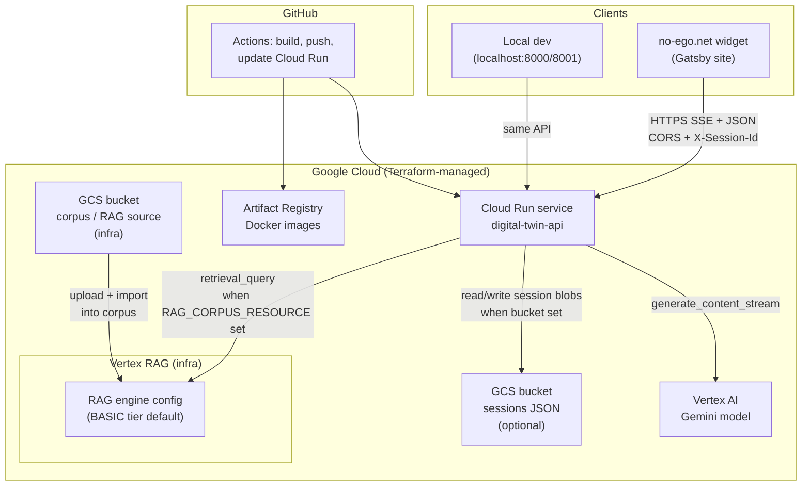
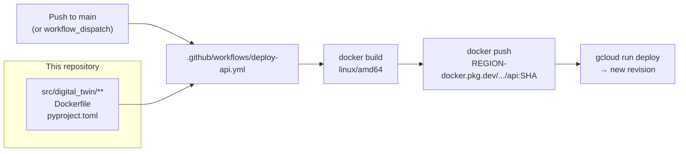
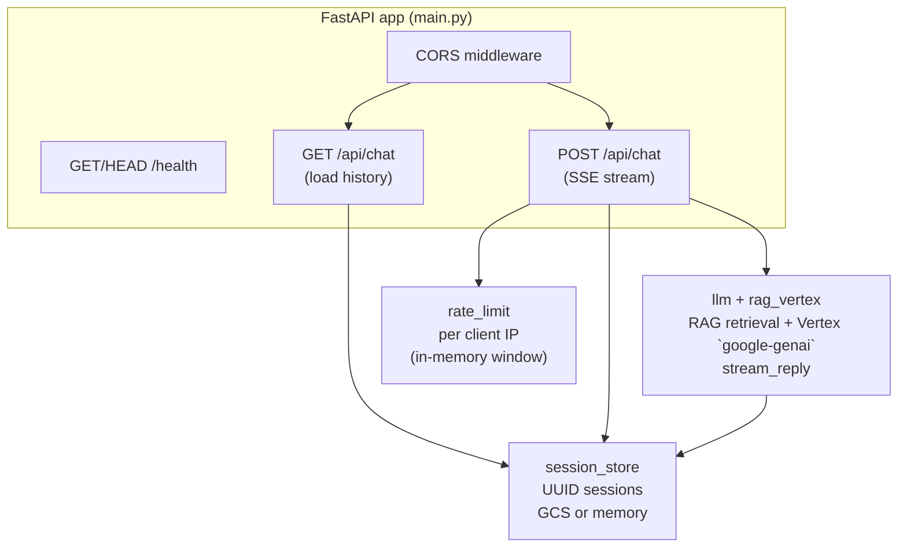
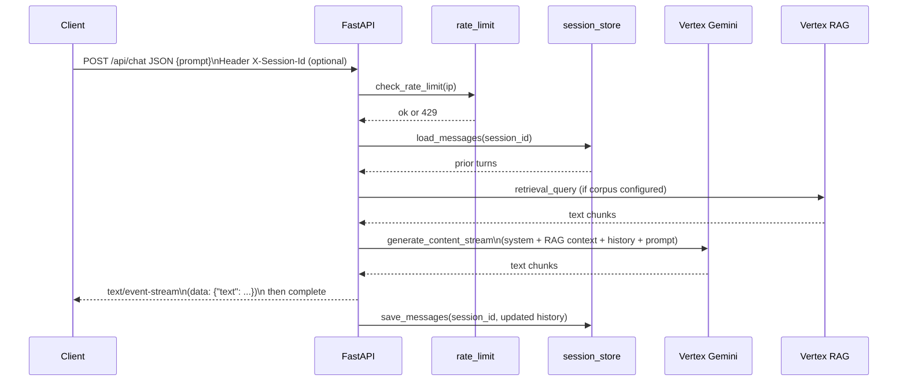

# Architecture

This document describes how the **digital-twin-api** service fits into the no-ego stack, what it depends on at runtime, and how changes reach production.

## System context

**Notes**

- **Sessions**: If `GCS_SESSIONS_BUCKET` is unset, chat history stays in **process memory** only (lost on scale/cold start).
- **Knowledge in answers**: **System instruction** from `system.md` only. Biography files live in the **corpus bucket**, are **imported into a Vertex RAG corpus**, and are merged per turn via **`rag.retrieval_query`** when **`RAG_CORPUS_RESOURCE`** is set (`rag_vertex.py` + `llm.py`).

## Deployment pipeline

Authentication uses **Workload Identity Federation** from GitHub Actions into GCP (see `docs/WORKING.md`).

## In-process architecture (API service)

- **Rate limiting** is **per Cloud Run instance** (in-memory); under multiple instances, effective limits scale with replicas.
- **POST /api/chat** runs model generation and persistence off the event loop via `asyncio.to_thread` so the server stays responsive while calling blocking SDK code.

## Chat request flow (POST)

## Repository layout (concise)

| Path | Role |
|------|------|
| `src/digital_twin/main.py` | HTTP API, SSE assembly |
| `src/digital_twin/llm.py` | `system.md` + optional RAG context; Vertex Gemini streaming |
| `src/digital_twin/rag_vertex.py` | `rag.retrieval_query` into corpus |
| `src/digital_twin/session_store.py` | Session JSON in GCS or memory |
| `src/digital_twin/rate_limit.py` | Per-IP RPM limit |
| `src/digital_twin/prompts/` | `system.md` only in git; local uploads gitignored |
| `terraform/` | Cloud Run, buckets, Vertex/RAG infra, IAM, registry |
| `.github/workflows/deploy-api.yml` | CI/CD to Artifact Registry + Cloud Run |

For day-to-day operations and secrets, see `docs/WORKING.md`.
