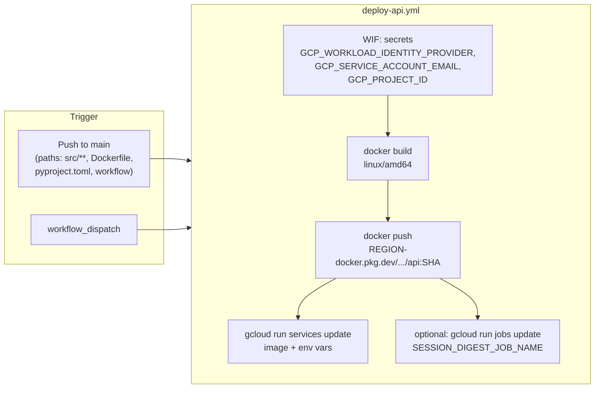
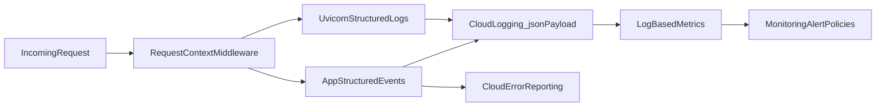
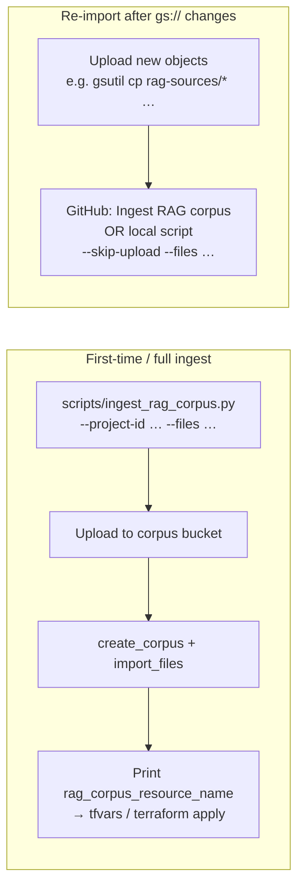
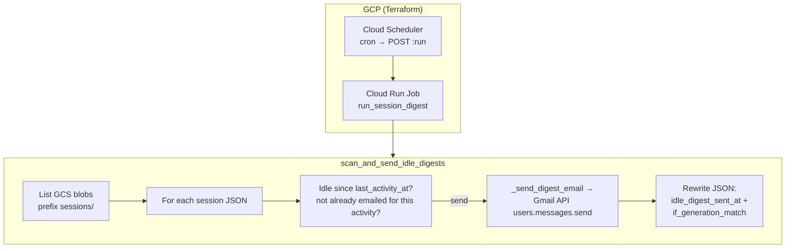
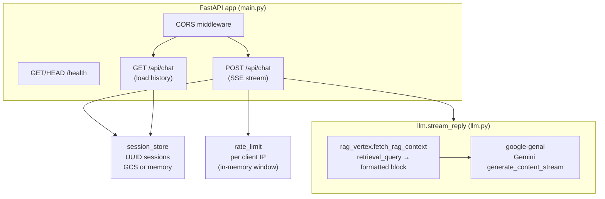
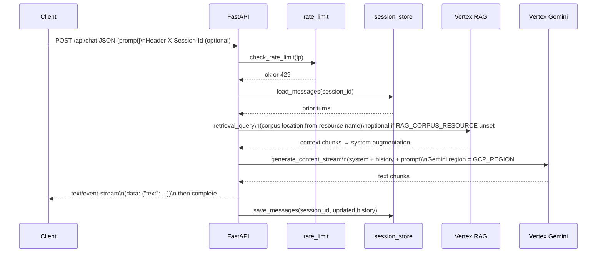

# Architecture

This document describes how the **digital-twin-api** service fits into the surrounding frontend and GCP stack, what it depends on at runtime, and how changes reach production.

## System context

```mermaid
flowchart TB
    subgraph clients["Clients"]
        Web["Static site / widget\n(e.g. GitHub Pages)"]
        Dev["Local dev\n(localhost:8000/8001)"]
    end

    subgraph gcp["Google Cloud (Terraform-managed)"]
        CR["Cloud Run\n digital-twin-api"]
        AR["Artifact Registry\nDocker images"]
        GCS_S["GCS: sessions bucket\nJSON per session\n(optional)"]
        GCS_C["GCS: corpus bucket\ncurated files\n(e.g. rag-sources/)"]
        Vertex["Vertex AI\nGemini\n(google-genai)"]
        subgraph vertex_rag["Vertex RAG Engine"]
            RAGCfg["RAG engine config\nper region\n(Spanner tiers or\nSERVERLESS via API)"]
            Corpus["RagCorpus\n(imported GCS URIs)"]
        end
        SM["Secret Manager\noptional: SA JSON\nfor Gmail digest"]
        Gmail["Gmail API\nsend as delegated\nWorkspace user"]
        CR_JOB["Cloud Run Job\nsession digest\n(Terraform)"]
        Sched["Cloud Scheduler\ntriggers digest job"]
    end

    subgraph github["GitHub Actions"]
        DeployWF["deploy-api.yml\npush main / dispatch"]
        IngestWF["ingest-rag-corpus.yml\nworkflow_dispatch only"]
        TfWF["terraform.yml\nPR/main plan;\ndispatch apply"]
    end

    subgraph repo["Repository (operators)"]
        IngestPy["scripts/ingest_rag_corpus.py\nupload + corpus + import"]
        RagSrc["rag-sources/**\n(e.g. knowledge.txt)"]
    end

    Web -->|HTTPS JSON + SSE\nCORS + X-Session-Id| CR
    Dev --> CR
    DeployWF --> AR
    DeployWF --> CR
    IngestWF -->|"WIF; terraform init/output;\nuv sync; ingest_rag_corpus.py"| Corpus
    TfWF -.->|"WIF; plan/apply\nremote state"| GCS_C
    RagSrc -->|"local ingest or\ngsutil cp → bucket"| GCS_C
    GCS_C -->|"import_files"| Corpus
    RAGCfg -.->|"Spanner: TF tier;\nServerless: ingest"| Corpus
    CR -->|generate_content_stream\nGCP_REGION| Vertex
    CR -->|retrieval_query\nregion from corpus resource name| Corpus
    CR -->|read/write when bucket set| GCS_S
    Sched -->|OAuth POST :run| CR_JOB
    CR_JOB -->|list blobs,\nconditional send + CAS| GCS_S
    CR_JOB -.->|GMAIL_SERVICE_ACCOUNT_JSON| SM
    CR_JOB -.->|domain-wide delegation| Gmail
    DeployWF -->|optional: same image| CR_JOB
    IngestPy --> GCS_C
    IngestPy --> Corpus
```

**Notes**

- **Sessions**: If `GCS_SESSIONS_BUCKET` is unset, history stays in **process memory** (lost on recycle/scale-out). Session JSON in GCS includes **`last_activity_at`** (set on each save) for digest eligibility.
- **Idle session digest (optional)**: **Cloud Scheduler** invokes a **Cloud Run Job** (Terraform **`digest_job.tf`**) that runs **`scan_and_send_idle_digests`** once per execution. After **`RESUME_BOT_DIGEST_IDLE_MINUTES`** (default 60) without activity on a session blob, it emails a **plain-text transcript attachment** via **Gmail** (**domain-wide delegation** as **`GMAIL_DELEGATED_USER`**). Successful sends set **`idle_digest_sent_at`** with **generation-match (CAS)**. **Requires GCS** sessions. The **API service** does not run digest logic, so **multiple API replicas** do not multiply scanners.
- **RAG is optional**: If `RAG_CORPUS_RESOURCE` is unset, answers use **`system.md` only** (no retrieval). When set, `rag_vertex.fetch_rag_context` runs **`vertexai.rag.retrieval_query`**, formats chunks, and **`llm.stream_reply`** appends them to the system instruction before calling Gemini.
- **Two regions**: **Gemini** uses **`GCP_REGION`** (default `us-central1` on Cloud Run). **Retrieval** initializes Vertex in the **location embedded in `RAG_CORPUS_RESOURCE`** (e.g. `.../locations/europe-west4/ragCorpora/...` when using a backup ingest region). See `rag_vertex.py` and `terraform/README.md` (RAG backup region).
- **Tuning**: **`RAG_TOP_K`**, optional **`RAG_VECTOR_DISTANCE_THRESHOLD`** (see `main.py` / `.env.example`).
- **`RAG_CORPUS_RESOURCE` on Cloud Run**: Set via Terraform **`rag_corpus_resource_name`** → env on the service (source of truth). **Deploy API** does not override it. **Ingest RAG corpus** reads **`rag_corpus_resource_name`** from remote Terraform state (with **`gha_terraform_state_bucket`** IAM), not from GitHub Variables.
- **Terraform remote state**: **GCS** backend with bucket injected at init (`terraform init -backend-config="bucket=..."`). Keep repository Variable `TF_STATE_BUCKET` equal to `gha_terraform_state_bucket`; see `terraform/README.md`. `terraform/backend.tf.example` is an optional full-backend template.

## Deployment pipeline (API image)

On deploy, **environment variables** for the **API service** use a **custom delimiter** (`^;^`) so **`CORS_ALLOWED_ORIGINS`** can contain commas. Optional repository **Variables** include **`CORS_ALLOWED_ORIGINS`**, **`GEMINI_MODEL`**, **`GEMINI_LOCATION`**, and **`GEMINI_TEMPERATURE`**. **`RAG_CORPUS_RESOURCE`** is Terraform-only. **Idle digest** Gmail and recipients are configured on the **Cloud Run Job** via Terraform, not the deploy workflow. If **`SESSION_DIGEST_JOB_NAME`** is set, the workflow also updates that job’s **image** to match the API image.

Secret names and copying Terraform outputs into GitHub are documented in **`terraform/README.md`** and helper **`scripts/print-github-actions-secrets.sh`**.

## Observability architecture

Runtime logging is structured end-to-end:

- `observability.setup_logging()` installs a JSON formatter for Python logs.
- FastAPI middleware creates/propagates `X-Request-Id`, parses `x-cloud-trace-context`, and injects request context into logs.
- Uvicorn uses `uvicorn_logging.json` so access/error logs follow the same JSON format.
- Caught-but-important failures are emitted as named events and also reported through Cloud Error Reporting (`report_exception`).

### Structured event model

High-signal API events currently include:

- `chat_model_invocation_failed`
- `chat_session_persist_failed`
- `chat_request_completed`
- `exception_reported`

Alerting in Terraform now combines:

- broad fallback (`severity>=ERROR`) for unknown/unexpected issues
- event-specific alerts keyed on `jsonPayload.event`
- sustained-volume alerting to reduce one-off alert noise

## RAG corpus lifecycle

Typical operator flow (details in **`terraform/README.md`** → RAG):

- **`.github/workflows/ingest-rag-corpus.yml`**: Manual dispatch only. Same **secrets** as Deploy API; **`terraform init`** / **`terraform output`** supply **`corpus_bucket_name`** and **`rag_corpus_resource_name`** (set **`gha_terraform_state_bucket`** + repository Variable **`TF_STATE_BUCKET`**, then apply for state-bucket IAM). Then **`ingest_rag_corpus.py`** with **`--skip-upload`** imports the **entire** `gs://<bucket>/rag-sources/` prefix; **`--files`** only satisfies the CLI (see **[rag-ingestion.md](rag-ingestion.md)**).
- **Local full ingest**: **`uv sync`**, ADC (`gcloud auth application-default login`), then **`uv run python scripts/ingest_rag_corpus.py`** (can create corpus, upload, import, and ensure RAG engine Spanner tier or Serverless when needed — see script docstring).

## Idle session digest (email)

Implemented in **`session_digest.py`** (`scan_and_send_idle_digests`). **Production** runs it from **`uv run python -m digital_twin.run_session_digest`** inside a **Cloud Run Job** on a **Scheduler** cadence (see **`terraform/digest_job.tf`**). The API does not start a background task.

**Configuration (production via Terraform variables → job env)**

| Terraform / runtime | Role |
|----------------------|------|
| `GCS_SESSIONS_BUCKET` (from Terraform on job) | Session persistence (digest skips in-memory-only setups). |
| `session_digest_email_to` → `RESUME_BOT_DIGEST_EMAIL_TO` | Recipients. |
| `session_digest_delegated_user` → `GMAIL_DELEGATED_USER` | Workspace sender (SA impersonation). |
| `session_digest_gmail_secret_id` → Secret env `GMAIL_SERVICE_ACCOUNT_JSON` | SA key JSON from Secret Manager. |

**Local dev:** `GMAIL_SERVICE_ACCOUNT_KEY_FILE` plus the same env names as above.

**Optional tuning**: Terraform **`session_digest_idle_minutes`**, **`session_digest_display_timezone`** (`RESUME_BOT_DIGEST_TIMEZONE`), **`session_digest_schedule`** / **`session_digest_scheduler_timezone`**, `GCS_SESSIONS_PREFIX` (default `sessions`).

**Runbook**: **[session-digest.md](session-digest.md)**; Terraform **[`terraform/README.md`](../terraform/README.md)** → *Idle session digest*.

## In-process architecture (API service)

**`llm.stream_reply`** runs **`rag_vertex.fetch_rag_context`** first when **`RAG_CORPUS_RESOURCE`** is set (merges chunks into the system instruction), then calls **`google.genai`** with **`GCP_REGION`** for the model client. Session **save** after the stream is handled in **`main.py`**, not inside **`llm.py`**.

- **Rate limiting** is **per Cloud Run instance**; more replicas mean higher aggregate allowance unless you add shared state.
- **POST /api/chat** uses **`asyncio.to_thread`** for model work and session persistence so the event loop stays responsive.

## Chat request flow (POST)

## Repository layout (concise)

| Path | Role |
|------|------|
| `src/digital_twin/main.py` | HTTP API, SSE, env wiring |
| `src/digital_twin/llm.py` | System prompt; optional RAG block; Vertex Gemini streaming |
| `src/digital_twin/rag_vertex.py` | `vertexai.rag.retrieval_query` + chunk formatting |
| `src/digital_twin/session_store.py` | Session JSON in GCS or memory; **`last_activity_at`** on save |
| `src/digital_twin/session_digest.py` | Idle digest: GCS scan, Gmail send, **`idle_digest_sent_at`** + CAS |
| `src/digital_twin/rate_limit.py` | Per-IP RPM limit |
| `src/digital_twin/prompts/` | `system.md` (packaged in wheel) |
| `rag-sources/` | Curated corpus files for upload / ingest (e.g. `knowledge.txt`) |
| `scripts/ingest_rag_corpus.py` | Upload to corpus bucket, corpus create/import, CLI |
| `scripts/print-github-actions-secrets.sh` | Helper to print Terraform outputs for GitHub secrets |
| `terraform/` | Cloud Run, buckets, RAG engine, IAM, Artifact Registry, optional WIF |
| `terraform/backend.tf` | GCS remote state backend (tracked; CI + local) |
| `terraform/backend.tf.example` | Template for forks / alternate buckets |
| `.github/workflows/deploy-api.yml` | Build/push image, update Cloud Run |
| `.github/workflows/ingest-rag-corpus.yml` | Manual RAG re-import from bucket |

Runtime dependencies include **`google-genai`** (Gemini), **`google-cloud-aiplatform`** (Vertex RAG / ingest), **`google-api-python-client`** and **`google-auth`** (Gmail digest). See `pyproject.toml`.

For operator runbooks (RAG ingest, Terraform, digest), see the repository **[README.md](../README.md)** and **[rag-ingestion.md](rag-ingestion.md)**.
