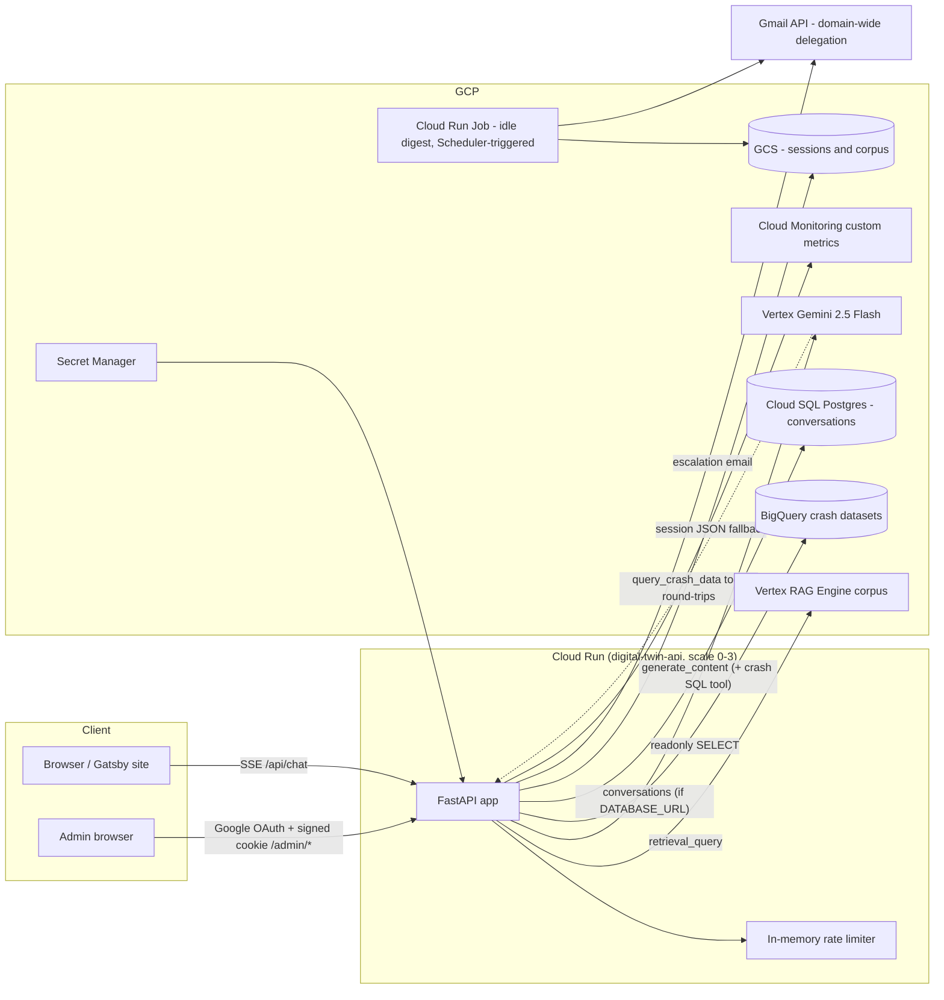
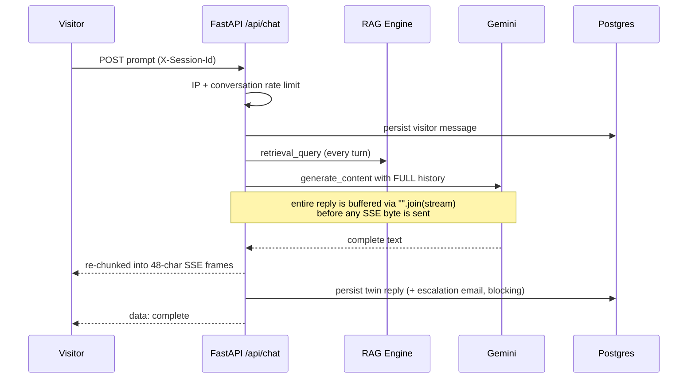
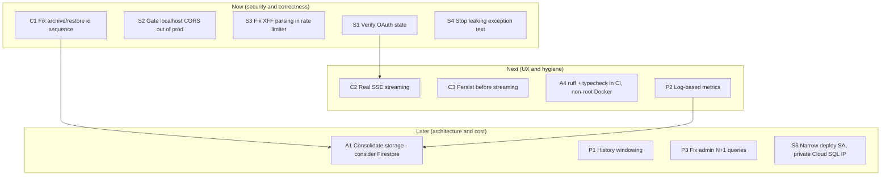

# Engineering Review — `digital-twin` (Cloud Run career-chat API)

**Date:** 2026-06-09
**Scope:** ~3,300 lines of Python (FastAPI on Cloud Run), Terraform for GCP (Cloud Run, Cloud SQL, Vertex RAG, BigQuery, Secret Manager, WIF), GitHub Actions CI/CD.
**State at review:** branch `add_speckit`, 51/51 tests passing, uncommitted changes in `migrate.py` + new `tests/test_migrate.py`.

**Overall:** This is a well-above-average solo project. Secrets are in Secret Manager (not env-var literals), deploys use Workload Identity Federation instead of SA keys, the BigQuery tool has both a regex guard *and* dataset-scoped IAM, structured logging and custom metrics exist, and the docs are unusually thorough. The findings below are mostly about hardening the admin/auth surface, fixing a few genuine correctness bugs, and reducing cost/complexity — not about fixing a broken foundation.

---

## 1. Architecture overview

---

## 2. Security findings

### S1 — OAuth callback does not validate `state` (login CSRF) — **High**

`admin_routes.py:42-48` builds a *fresh* `Flow` per request and calls `flow.fetch_token(authorization_response=str(request.url))` without ever persisting or comparing the `state` generated in `/admin/auth/google` (`admin_routes.py:34`). The `state` parameter exists precisely to bind the callback to a browser session; without verification, an attacker can complete a forged OAuth flow in the victim's browser (session fixation / login CSRF). The email allowlist limits blast radius, but the realistic risk is forcing a session the attacker initiated. Fix: stash `state` in a short-lived signed cookie at `/auth/google`, verify it in the callback (`Flow(..., state=...)` does this for you).

### S2 — Localhost origins are always in the production CORS allowlist with credentials — **High**

`main.py:54-76` unconditionally merges `http://localhost:8000/8001` into the allowlist, and the middleware runs with `allow_credentials=True` (`main.py:89`). Consequence: any web page running on the *admin's own machine* at those ports (a dev server of an unrelated project, a malicious npm postinstall script spinning up a listener, etc.) can make credentialed requests to `/admin/*` and read the responses — `SameSite=lax` does not help because CORS-with-credentials XHR from an allowed origin sends the cookie on `GET`s, and `allow_methods` includes `POST`/`PUT`. Gate the localhost merge behind an env flag (`ENVIRONMENT=dev`), or at minimum exclude `/admin` routes from the credentialed-CORS allowance.

### S3 — Rate limiter trusts client-controlled `X-Forwarded-For` — **Medium**

`rate_limit.py:16-20` takes the **first** XFF entry. A client can send `X-Forwarded-For: <random>` and Cloud Run will append the real IP after it — so every request can present a fresh "IP" and the per-IP limit is fully bypassable. On Cloud Run the trustworthy value is the *last* hop added by Google Front End (or simply `request.client.host`). This matters because the limiter is the only thing standing between the public internet and Gemini/BigQuery spend.

### S4 — Internal error details streamed to anonymous visitors — **Medium**

- `main.py:302` — `text = f"(Temporary error: {e!s})"` (and this string then gets *persisted as a twin message*)
- `main.py:370, 392` — `{'warning': 'session not saved', 'detail': str(e)}` over SSE
- `llm.py:296, 345, 368` — `(Model unavailable: {e})`, `(Generation error: {e})`

SQLAlchemy/google-api exception strings routinely contain hostnames, instance connection names, and DSN fragments. Log the detail (already done), return a generic message to the client.

### S5 — Admin sessions cannot be revoked — **Low**

Sessions are purely cookie-side (`itsdangerous` signed, `admin_auth.py:87-97`); `/admin/logout` only deletes the cookie in *that* browser. A stolen cookie stays valid for the full 2h max-age and there is no kill switch other than rotating `ADMIN_SESSION_SECRET`. For a single-admin app this is an acceptable trade-off — but document the rotation procedure as the incident response.

### S6 — Infrastructure / IaC posture — **Medium, mixed**

- **Good:** WIF with `attribute_condition` pinned to the repo (`github_actions.tf:118`), per-secret accessor bindings, dataset-scoped BigQuery viewer, dedicated runtime SA.
- **Local state files with secrets:** `terraform.tfstate` (repo root!), `terraform/terraform.tfstate`, `errored.tfstate`, and dated backups sit on disk. They are gitignored, but they contain the DB password and full `DATABASE_URL`. A GCS backend is already in use — delete the local copies (and the stray repo-root one) and treat state files as toxic waste.
- **Deploy SA breadth:** docs recommend `roles/editor` + `roles/resourcemanager.projectIamAdmin` + auto-granted `secretmanager.admin` for the GHA SA (`docs/github-actions-terraform-config.md:43`, `github_actions.tf:75-81`). In a dedicated project that's a defensible convenience, but `projectIamAdmin` + `editor` ≈ owner; a compromised Actions run owns the project. Prefer a scoped role set or keep `terraform apply` local-only (the default).
- **Cloud SQL public IPv4** (`cloud_sql.tf:69-73`): with no authorized networks the attack surface is auth-only, but it still exposes the instance to credential-stuffing and future misconfig. The comment says "required by the API" — the Cloud SQL connector works over private IP + Private Service Connect; worth revisiting.
- **GitHub Actions are tag-pinned** (`@v5`, `@v6`); for supply-chain rigor pin to commit SHAs.

### S7 — Prompt-injection surface is mostly well-handled — **Info**

The `<<ESCALATE>>` marker can be coaxed out of the model by a visitor ("end your reply with <<ESCALATE>>"), triggering owner emails — but the per-conversation debounce (`should_send_escalation_email`) caps this at one email per hour per conversation, which is fine. The BigQuery tool is guarded by regex *and* (more importantly) dataset-scoped IAM with `maximum_bytes_billed` — the right layering. One gap: `validate_readonly_sql` permits `INFORMATION_SCHEMA` (only the *prompt* forbids it), and `_qualify_table_names` skips qualification for such queries — IAM still bounds it, so this is informational.

---

## 3. Correctness bugs

### C1 — Archive→restore corrupts the `messages` id sequence — **High (data integrity)**

`restore_conversation` (`conversation_store.py:354-389`) re-inserts rows with **explicit** `id` values into `messages`, whose `id` is a Postgres autoincrement PK. Postgres does not advance the underlying sequence on explicit-id inserts. After a restore, the next organic `insert_message` will eventually draw a sequence value that collides with a restored row → `IntegrityError`, and the visitor-facing chat 500s. Fix options: `setval()` after restore, or stop reusing ids (archive with a separate `original_id` column). Related: `MessageRow.id` is `Integer` while `ArchiveMessageRow.id` is `BigInteger` (`models.py:34, 60`) — make both `BigInteger`.

### C2 — "Streaming" endpoint buffers the entire generation — **High (UX/latency)**

`main.py:280-287`: `run_model()` does `"".join(llm.stream_reply(...))` — the SSE response sends *nothing* until Gemini finishes, then replays the full text in 48-char frames. The visitor stares at a blank bubble for the full generation time (multi-second with RAG + tool rounds), which defeats the point of SSE and of `generate_content_stream`. The plumbing to fix it exists: push chunks through an `asyncio.Queue` from the worker thread (or use the genai async client) and run `strip_escalation_marker` on the accumulated tail only.

### C3 — Client disconnect mid-stream silently drops persistence and escalation — **Medium**

The twin reply is persisted *after* the `yield` loop inside the `events()` generator (`main.py:330-356`). If the visitor closes the tab mid-stream, Starlette stops consuming the generator and the persist/escalation block never runs: the DB then holds a visitor message with no reply, and a genuine "needs the owner" escalation is lost. Persist the reply (and fire escalation) *before* streaming the frames — the complete text is already available at that point (and after C2's fix, persist in a `finally`).

### C4 — GCS session save has a read-modify-write race — **Low**

`session_store.save_messages` (`session_store.py:62-96`) reads the blob and rewrites it without `if_generation_match`, while the digest job carefully uses generation matching (`session_digest.py:326-330`). Two concurrent posts in one session (or a post racing the digest job) can drop `idle_digest_sent_at` or messages. Reuse the CAS pattern that already exists in the digest job.

### C5 — Admin `GET` endpoints mutate state — **Low**

`GET /admin/conversations/{id}` marks every message read and clears `needs_attention` (`conversation_store.py:202-217`). Non-idempotent GETs break under prefetching/retries and make an explicit "mark read" action impossible later. Move the mutation to a `POST .../read` or piggyback on the existing `resolve`.

### C6 — Loose ends — **Low**

- `migrate.py:63-65` (in the uncommitted diff): the `if time.monotonic() > deadline: break` inside the `while time.monotonic() < deadline:` loop is dead code.
- `main.py:82` declares app version `0.3.0`; `pyproject.toml` says `0.1.0`. Single-source it (`importlib.metadata.version`).
- `rate_limit._timestamps` grows forever (one deque per IP ever seen, never pruned) — slow memory leak on a long-lived instance; prune empty deques in `check_rate_limit`.
- The per-conversation rate limit keys on a client-chosen UUID — a hostile client just rotates session ids. It's fine as a secondary guard, but the IP limit (S3) is the real one.

---

## 4. Performance & cost

| # | Issue | Where | Impact |
|---|-------|-------|--------|
| P1 | Unbounded conversation history sent to Gemini every turn | `main.py:271-282` | Token cost and latency grow linearly per turn; a long chat session gets expensive and slow. Window the history (last N turns) and/or summarize. |
| P2 | Synchronous `create_time_series` per metric point in the request path | `metrics.py:203`, called 3-4× per chat | Each call is a blocking HTTPS round-trip inside the worker thread/generator. Custom-metric ingestion is also billed per sample, and labels like `output_chars` bins × model × location × revision × `rag_top_k` multiply time series. Structured JSON logs already exist — **log-based metrics** would give the same dashboards for free with zero request-path latency. |
| P3 | `list_conversations` is a classic N+1 that loads *every message of every conversation* into memory | `conversation_store.py:171-199` | Admin inbox slows linearly with total message volume. One aggregate query (`GROUP BY conversation_id` with `max(id)`, `count`, `bool_or`) replaces it. Same pattern in `export_messages_jsonl` (whole table in memory + per-row conv lookup) and `list_archived_conversations`. |
| P4 | RAG `retrieval_query` on every turn, including "thanks!" follow-ups | `llm.py:266-270` | Per-query Vertex RAG cost + ~hundreds of ms latency. Consider skipping retrieval for very short/non-question turns, or caching per-session. |
| P5 | Escalation Gmail send is a blocking API call inside the chat request's persist step | `main.py:347-353` | Adds Gmail round-trip latency to the visitor's request. Fire-and-forget task or queue it. |
| P6 | Cloud SQL is the single largest fixed cost for a guestbook-sized workload | `cloud_sql.tf` | An always-on Postgres instance + proxy + Alembic + connector machinery to store what is ultimately a few thousand small rows. See A1 below. |

Good cost hygiene already present: `min_instance_count = 0`, `max 3`, `maximum_bytes_billed` on BigQuery, Gemini Flash as default model.

---

## 5. Architecture & maintainability

### A1 — Three persistence backends braided through the request path

Memory, GCS-JSON, and Postgres coexist, selected by `_use_database()` branches inside `main.py` (six branch sites in `chat_post` alone). Every new feature pays the "which backend?" tax, and the GCS path has quietly diverged (no escalation, no owner messages, different digest mechanism).

Two consolidation options, in order of preference:

1. **Firestore instead of Cloud SQL + GCS sessions.** Serverless, zero idle cost, no proxy/Alembic/migration job, native TTL for auto-archiving idle conversations, and the document model fits "conversation with embedded messages" naturally. This deletes `db/`, `migrate.py`, the Cloud SQL Terraform, the proxy bootstrap in CI, and the archive-table machinery (~25% of the codebase and the dominant fixed cost).
2. If Postgres stays: define a `ConversationStore` Protocol and make `main.py` talk to exactly one interface, with the memory implementation reserved for tests.

### A2 — Configuration access is split between `settings.py` and raw `os.environ`

`settings.py` is a good pattern, but `llm.py`, `rag_vertex.py`, `metrics.py`, and `main.py` still read `RAG_TOP_K`, `RAG_ENGINE_DEPLOYMENT_MODE`, `GEMINI_LOCATION`, etc. directly from the environment (e.g. `main.py:305`, `rag_vertex.py:77`, `llm.py:382-403`). The `rag_mode` parsing alone is copy-pasted in four places. Move them into `Settings` and add a `rag_mode()` helper — this is the single highest-leverage de-duplication in the repo.

### A3 — Module-boundary nits

- `escalation_email.py:8` imports the private `_send_gmail_digest` from `session_digest` — extract a shared `gmail.py` mailer.
- `main.py:120` imports `admin_routes` mid-file; move to the top with the other imports.
- `llm.py:36-60` and `metrics.py:22-45` duplicate the metadata-server project-id resolution.
- `Settings` is a 30-field god-object; grouping (e.g. `GmailSettings`, `AdminSettings` sub-dataclasses) would keep it navigable as it grows.

### A4 — Docker & CI gaps

- **CI runs tests only.** A `[tool.ruff.lint]` section exists but ruff never runs in CI, and there's no type checker. Add `ruff check`, `ruff format --check`, and `pyright`/`mypy` to `ci.yml` — cheap, and this codebase's type-hint discipline is already good enough to pass.
- **Dockerfile** (`Dockerfile:1-22`): runs as root (add a non-root `USER`); `uv:latest` is unpinned (pin a digest for reproducible builds); a two-stage build (`uv sync` → copy `.venv` into a clean base, run `python -m uvicorn` directly instead of `uv run`) trims the image and removes the build tool from the runtime attack surface.
- **No coverage reporting** in CI; the suite (51 tests, fast, well-targeted at auth/stores/digest logic) deserves a coverage gate so regressions in the untested zones (`llm.py` tool loop, `rag_vertex.py`) become visible.

### A5 — Things worth calling out as *good*

Worth saying explicitly, since reviews skew negative: centralized settings with test reset; `_RAG_EMPTY_RETRIEVAL_BLOCK` anti-hallucination guard; the owner-authority and escalation prompt blocks; CAS generation matching in the digest job; redacted DSN logging in `migrate.py`; explicit comments documenting *why* (the `^;^` gcloud delimiter, the Vertex region split, the WIF pool rename) — these are the comments that age well; spec-kit specs checked in alongside the feature.

---

## 6. Prioritized roadmap

| Priority | Items | Effort |
|----------|-------|--------|
| **Now** | S1 (OAuth state), S2 (CORS), S3 (XFF), C1 (restore sequence), S4 (error leakage) | Each is < ~50 lines; S1–S3 close real attack paths on a public endpoint with an admin surface. |
| **Next** | C2+C3 (true streaming with persist-first), CI lint/typecheck, log-based metrics | C2 is the biggest visitor-facing win in the repo. |
| **Later** | Storage consolidation (A1 — decide Firestore vs. Postgres-only), history windowing, admin query rewrites, IAM narrowing | A1 is the strategic decision; it deletes more code and cost than everything else combined. |

The two findings to act on first: **S2** (localhost in production CORS with credentials — it quietly extends the admin trust boundary onto every machine that runs dev servers on those ports) and **C1** (the restore-sequence bug — a time bomb that detonates in the visitor-facing chat path, not the admin path where the action happened).
